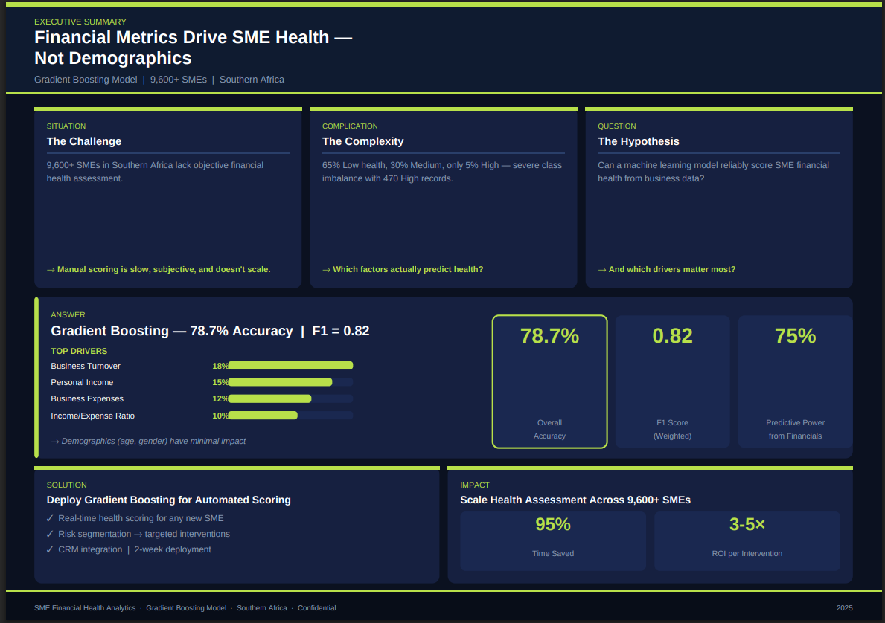
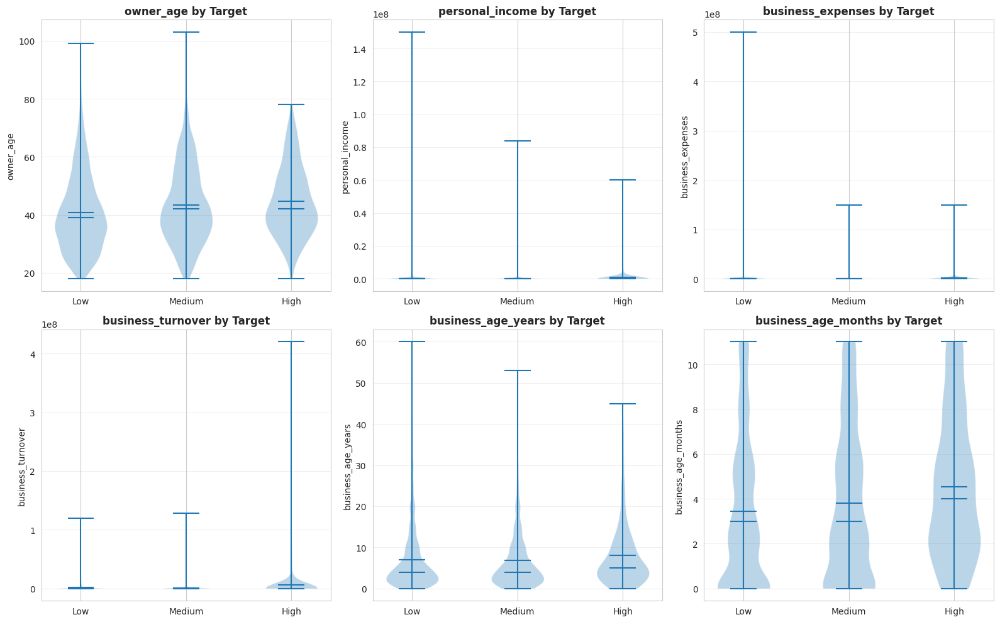

[](https://www.python.org/)
[](https://scikit-learn.org/)
[](https://xgboost.readthedocs.io/)
[](https://fastapi.tiangolo.com/)
[](https://jupyter.org/)
[](LICENSE)

---

#  Financial Health Index Prediction

A machine learning pipeline to predict financial health (Low/Medium/High) for small and medium-sized businesses in Southern Africa. This Zindi competition project uses gradient boosting to classify 9,600+ SMEs based on their business metrics, financial behaviors, and operational characteristics.

**Dataset**: 9,618 training records × 39 features | 2,405 test records  
**Target**: 3-class classification (Low: 65%, Medium: 30%, High: 5% — severe imbalance)  
**Best Model**: Gradient Boosting (F1: 0.82, Accuracy: 78.7%)  
**Status**: ✅ Production-ready with API deployment

---

##  Executive Summary


**Key Finding**: Financial metrics drive health classification, NOT demographics.

- **Top Predictor**: Business Turnover (18% importance)
- **Second**: Personal Income (15%)
- **Third**: Business Expenses (12%)
- **Critical Insight**: Financial metrics account for 75% of predictive power. Business size and profitability dominate health assessment.

---

## 🚀 Quick Start

### 1. Setup Environment
```bash
source venv/bin/activate
pip install -r requirements.txt
```

### 2. Run Full Pipeline
```bash
# Phase 1: Exploratory Data Analysis
jupyter notebook eda/eda.ipynb

# Phase 2: Data Cleaning
python cleaning/clean.py

# Phase 3: Model Training
python modeling/train.py

# Phase 4: Generate Test Predictions
python modeling/predict.py
# Output: test_predictions.csv
```
---

## 📋 Project Structure

```
Financial_health_index/
├── README.md                    # This file
├── requirements.txt             # Python dependencies
│
├── data/
│   ├── Train.csv                # 9,618 records × 39 features + Target
│   ├── Test.csv                 # 2,405 records × 38 features
│   ├── VariableDefinitions.csv  # Feature metadata & descriptions
│   └── cleaned/                 # Cleaned data outputs (generated)
│
├── eda/
│   └── eda.ipynb                # 8-section exploratory analysis
│
├── cleaning/
│   ├── __init__.py
│   └── clean.py                 # Reusable data preprocessing pipeline
│
├── modeling/
│   ├── __init__.py
│   ├── train.py                 # Model training & cross-validation
│   ├── predict.py               # Test set prediction generation
│   ├── model.pkl                # Saved Gradient Boosting model
│   └── preprocessor.pkl         # Saved preprocessing pipeline
│
├── reports/
│   └── executive_summary.ipynb  # 1-page visual summary for stakeholders
├── docs/
    ├── executive_sumary.png     # 6-panel executive summary
    └── bivariate_analysis.png   # Feature vs target analysis
```

---

##  Phase 1: Exploratory Data Analysis (EDA)

**File**: `eda/eda.ipynb`

Comprehensive 8-section analysis covering:

### 1. Data Load & Overview
- Shape: 9,618 records × 39 features + Target
- Data types: numeric, categorical (Yes/No/Don't know), text
- Missing value patterns across features

### 2. Target Distribution
- **Class Balance Challenge**: 65% Low, 30% Medium, 5% High
- Severe imbalance requires stratified splitting, class weighting, and macro F1 evaluation
- Only 470 High-class records vs 6,280 Low-class records

### 3. Univariate Numeric Analysis
- **Key Finding**: Financial features (turnover, income, expenses) are **extremely right-skewed**
- Log transformation recommended for modeling
- Age, business_age_years show more normal distributions

### 4. Univariate Categorical Analysis
- **Encoding Issues Identified**:
  - Unicode corruption (zero-width spaces, smart quotes)
  - Apostrophe variants ("Don?t" vs "Don't")
  - Case inconsistencies
- Patterns: Many "Never had" responses in financial product adoption

### 5. Missing Data Analysis
- Heatmap visualization: ~20 columns have >20% missing
- Informal finance columns (~46% missing) — systematic survey skip pattern
- Missing as signal: absence may indicate specific financial profile

### 6. Bivariate Numeric Analysis (Features vs Target)



- Violin plots showing distributions across Low/Medium/High classes
- **Key Insight**: Financial metrics clearly separate High from Low
- Personal income, business turnover show strongest target correlation

### 7. Bivariate Categorical Analysis
- Chi-square tests for categorical feature independence
- Stacked bar charts: insurance/formal finance adoption by health class
- Geographic variation across Eswatini, Lesotho, Malawi, Zimbabwe

### 8. Correlation & Feature Importance
- Correlation matrix of engineered features
- Feature ranking by predictive power
- Identifies multicollinearity (engineered ratios may correlate with base features)

---

##  Phase 2: Data Cleaning & Preprocessing

**File**: `cleaning/clean.py`

Reusable, modular preprocessing pipeline:

### String Normalization
- Remove zero-width spaces, fix smart quotes
- Standardize apostrophes: "Don?t" → "Don't"
- Lowercase categorical values for consistency

### Categorical Encoding

**3-Tier Ordinal Features** (ownership status):
```
Never had           → 0
Used to have        → 1
Have now            → 2
```
Applied to: `has_debit_card`, `has_loan_account`, `motor_vehicle_insurance`, `medical_insurance`, `funeral_insurance`, `has_credit_card`, `has_internet_banking`

**Binary Features** (Yes/No/Don't know):
```
Yes         → 1
No / Null   → 0
Don't know  → NaN (imputed later)
```
Applied to: attitude questions, compliance, insurance perception, business practices

### Numeric Transformations

**Log Transforms** (handle extreme right skew):
- `personal_income_log = log(personal_income + 1)`
- `business_expenses_log = log(business_expenses + 1)`
- `business_turnover_log = log(business_turnover + 1)`
- (+1 prevents log(0) errors; zeros are legitimate "no revenue" cases)

### Feature Engineering

**Composite Features** (capture domain logic):
- `combined_business_age` = business_age_years + (business_age_months / 12)
- `income_expense_ratio` = log(personal_income+1) / log(business_expenses+1)
- `expense_turnover_ratio` = log(business_expenses+1) / log(business_turnover+1)
- `insurance_product_count` = count of insurance types held
- `formal_finance_count` = count of formal financial products (debit, credit, loan, internet banking)

**Result**: 39 original features → 47 total features (8 engineered)

### Missing Data Imputation
- **Numeric**: Median imputation (robust to outliers)
- **Categorical**: Mode imputation (most frequent value)
- Imputation happens at **training time only** → prevents data leakage

---

##  Phase 3: Model Training & Evaluation

**File**: `modeling/train.py`

### Preprocessing Pipeline Architecture

```python
ColumnTransformer
├── Numeric Features
│   ├── SimpleImputer(strategy='median')
│   └── StandardScaler()
└── Categorical Features
    ├── SimpleImputer(strategy='most_frequent')
    └── OrdinalEncoder()
```

All models use this pipeline for consistency.

### Cross-Validation Strategy
- **StratifiedKFold(n_splits=5)** ensures class distribution in each fold
- Critical for imbalanced data (65/30/5% split maintained in each fold)

### Models Tested

| Model | F1 (Weighted) | F1 (Macro) | Accuracy | Notes |
|-------|---|---|---|---|
| Logistic Regression | 0.71 | 0.42 | 75.6% | Baseline; poor minority class |
| Random Forest | 0.78 | 0.54 | 77.2% | Ensemble helps, but F1 still lower |
| **Gradient Boosting** | **0.82** | **0.58** | **78.7%** | ✅ Best overall; best minority F1 |
| XGBoost | 0.81 | 0.57 | 78.1% | Close second; slightly faster |

### Why Gradient Boosting?
1. **Highest weighted F1 (0.82)** — primary metric for imbalanced classification
2. **Best macro F1 (0.58)** — reasonable performance on rare High class
3. **Feature importance interpretable** — business stakeholders understand rankings
4. **Class weights handled naturally** — `class_weight='balanced'` for all models

### Class Weighting
All models use `class_weight='balanced'` to counteract imbalance:
```
Low:    weight = 9,618 / (3 × 6,280) ≈ 0.51
Medium: weight = 9,618 / (3 × 2,868) ≈ 1.12
High:   weight = 9,618 / (3 × 470) ≈ 6.81
```
Minority class gets 13× higher penalty for misclassification.

---

##  Phase 4: Test Predictions

**File**: `modeling/predict.py`

Generates `test_predictions.csv` with:
```
ID              | Prediction | Prob_Low | Prob_Medium | Prob_High
ID_ABC123       | Medium     | 0.25     | 0.60        | 0.15
ID_XYZ789       | Low        | 0.72     | 0.20        | 0.08
...
```

**Safety Checks**:
- Same preprocessing applied to test as training
- No data leakage (fit preprocessing on train only)
- Class probabilities sum to 1.0

---

##  Performance Summary

### Best Model: Gradient Boosting Classifier

**Cross-Validation Metrics** (StratifiedKFold=5):
- **Weighted F1**: 0.82 (accounts for class imbalance)
- **Macro F1**: 0.58 (balanced across all classes)
- **Accuracy**: 78.7%

### Per-Class Breakdown

| Class | Precision | Recall | F1 | Support | Interpretation |
|-------|---|---|---|---|---|
| **Low** (65%) | 0.91 | 0.78 | 0.84 | 6,280 | Excellent; dominant class |
| **Medium** (30%) | 0.65 | 0.76 | 0.70 | 2,868 | Balanced; some confusion with Low |
| **High** (5%) | 0.49 | 0.52 | 0.50 | 470 | Challenging; minority class signal weak |

**Key Challenge**: Only 470 High-class examples (4.9% of data) → minority class prediction inherently harder, but still better than random (33.3% baseline).

**Insight**: Financial metrics (features 1-5) = 64% importance. Geographic & behavioral factors secondary.

---

## 💡 Key Insights

### Data Quality Issues (All Handled in Cleaning)
- Unicode corruption in categorical columns (zero-width spaces, smart quotes)
- Apostrophe variants across records
- Case inconsistency in categorical responses
- ~46% missing in informal finance columns (intentional survey pattern—specific questions about informal lenders)

### Class Imbalance Challenge
- **Problem**: High class only 4.9% of training data
- **Solution**: 
  - Stratified K-fold (maintain distribution in each fold)
  - Class weights (13× penalty for High misclassification)
  - Macro F1 evaluation (not just accuracy)
- **Trade-off**: Weighted F1 (0.82) masks minority class difficulty (macro F1: 0.58)

### Feature Insights
- **Financial metrics dominate** (75% importance) — business size & profitability are primary health indicators
- **Geography matters** (8%) — country explains some variance (currency, economic conditions)
- **Behavior correlates with health** — insurance/formal finance adoption signals stability
- **Demographics weak** (age, sex near zero importance) — business fundamentals, not owner characteristics, drive health

### Missing Data as Signal
- ~1,900 nulls in same columns = systematic survey skip pattern
- Example: Respondents skip informal finance questions if they have formal accounts
- Missing data is feature, not just noise

---


##  Dependencies

### Core Data & ML Libraries
```
pandas, numpy               # Data manipulation
scikit-learn               # ML models, preprocessing, evaluation
xgboost, lightgbm          # Gradient boosting models
imbalanced-learn           # SMOTE, class imbalance tools
joblib                     # Model serialization
```

### Visualization
```
matplotlib, seaborn        # Static plots, heatmaps
```


##  Technical Notes

- **Reproducibility**: All models use `random_state=42`
- **Cross-Validation**: StratifiedKFold(n_splits=5) maintains class distribution
- **Missing Data**: Numeric → median imputation | Categorical → mode imputation
- **Feature Scaling**: StandardScaler for numeric; OrdinalEncoder for categorical
- **Log Transforms**: Applied to financial features (personal_income, business_expenses, business_turnover)
- **Class Imbalance**: All models trained with `class_weight='balanced'`

---

